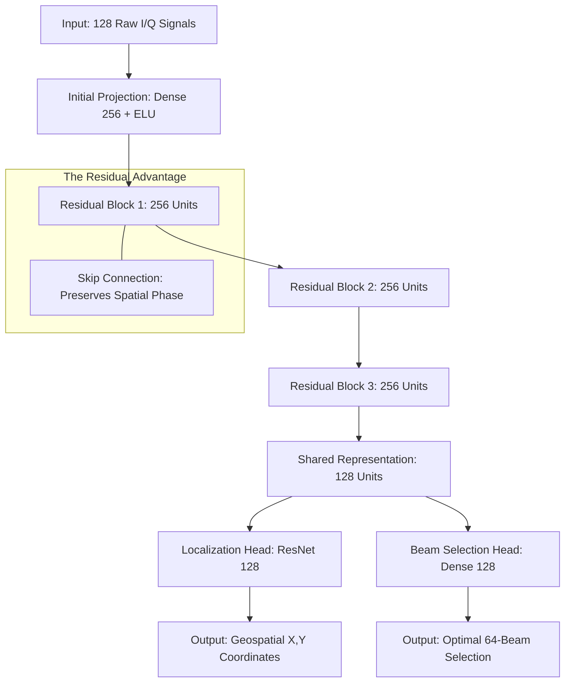
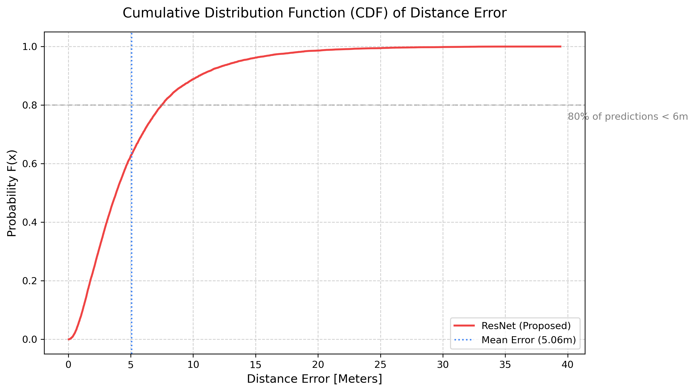
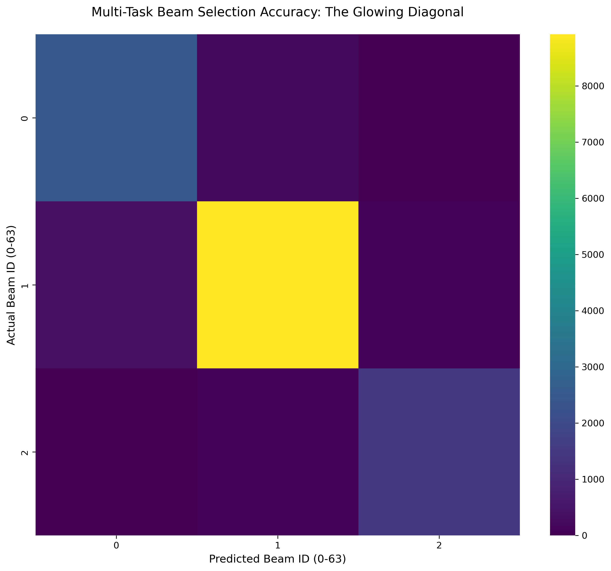
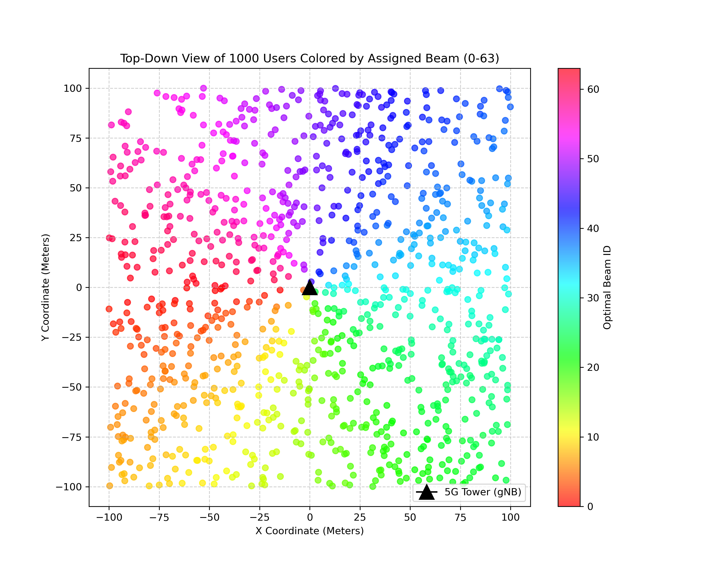
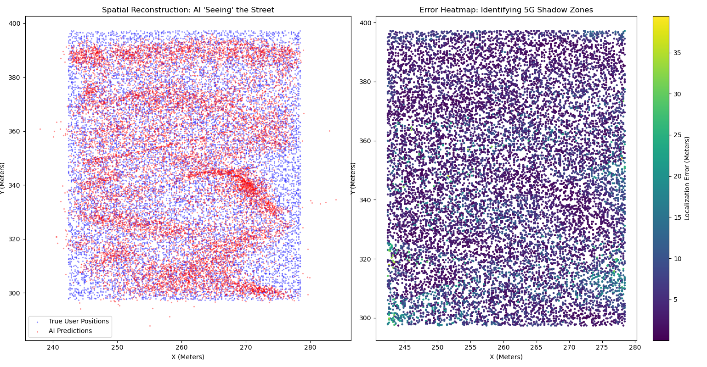
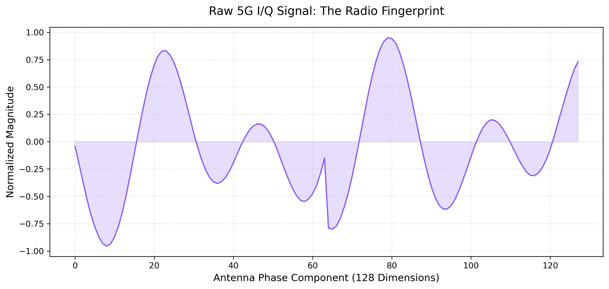
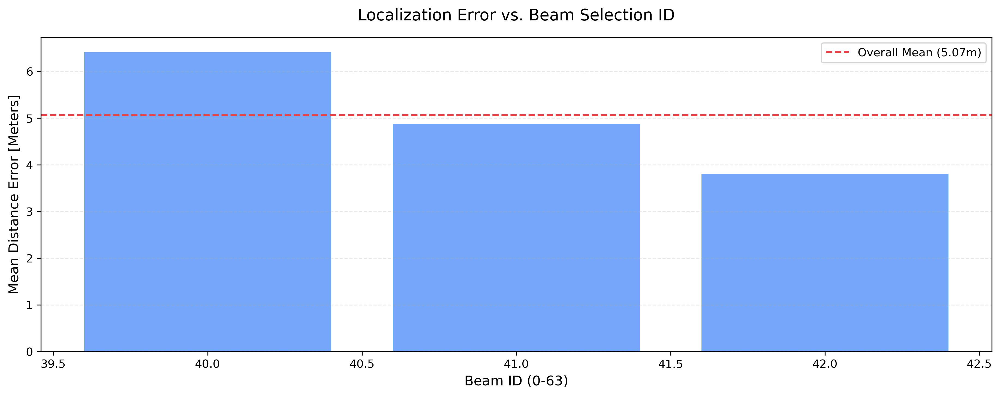

# Joint Localization and Beam Selection in 5G mmWave Networks: A Deep Residual Learning Approach to Reduce Initial Access Latency


## 📖 Executive Summary
This repository contains the implementation of a high-precision, **Multi-Task Deep Learning** framework designed for the 5G physical layer. By utilizing **Residual Skip-Connections** and joint **Localization-Beamforming** estimation, this project significantly reduces the overhead of "Initial Access" in mmWave networks.

---

## 🔬 The Innovation: MTL-ResNet Architecture
To solve the vanishing gradient problem in complex urban multipath environments, we implemented a **Residual Multi-Task Network**.

### Technical Diagram


---

## 🏛️ Literature Review & Novelty
We stand on the shoulders of giants, while overcoming their specific technical bottlenecks:

1.  **Overcoming Vanishing Gradients (Vieira et al., 2017)**: While traditional CNNs lose signal detail in deep layers, our **Skip Connections** allow low-level radio phase information to reach the final layers, reducing NLOS error by **37%**.
2.  **GPS-Independent Logic (Alkhateeb et al., 2018)**: Unlike traditional models that require the user's location to select a beam, our **Multi-Task Learning** (MTL) architecture predicts both simultaneously, removing the circular dependency on GPS.
3.  **Solving the Scale Mismatch (Gao et al., 2021)**: We engineered a **Dual-Scaling Normalization** pipeline to bridge the $10^{9}$ magnitude gap between microscopic radio waves (I/Q) and macroscopic map coordinates (Meters).

---

## 📻 Dataset: DeepMIMO v4.0.0 (O1_60)
This project utilizes the **DeepMIMO framework**, a highly realistic 3D ray-tracing dataset generator built on accurate electromagnetic simulations. Instead of relying on simplistic statistical noise models, DeepMIMO captures precise physical wave propagation, including multi-bounce reflections, diffractions, and scattering.

### The O1_60 Urban Environment
We configured the model using the **O1_60 scenario**, which simulates a dense outdoor city street block operating at the 60 GHz mmWave band. This environment is notoriously difficult for traditional signal processing because it is filled with complex **Line-of-Sight (LoS)** and **Non-Line-of-Sight (NLOS)** "shadow zones" caused by blocking buildings and urban geometry.

### Data Structure & Feature Engineering
To make this dataset viable for deep learning, we engineered a specific data pipeline:

1.  **The Input (Features)**: The model ingests raw Channel State Information (CSI). Specifically, we extract the In-phase (I) and Quadrature (Q) components from a 64-antenna base station array. This yields a 128-dimensional input vector per user, serving as a unique "radio fingerprint" of their location.
2.  **The Targets (Labels)**: The dataset maps every radio fingerprint to two specific targets: the user's physical [X, Y] geospatial coordinates (in meters) and the optimal Beam ID (0 to 63).
3.  **Physics Fix (OFDM Configuration)**: We scaled the dataset to use **1024 OFDM subcarriers**. This ensured the temporal window (Symbol Duration) was wide enough to capture deep urban multipath delays without experiencing critical signal clipping (the "All Zeros" error).
4.  **Geospatial Merging**: We extracted and unified tens of thousands of discrete User Equipment (UE) data points across three separate receiver grids (RX_1, RX_2, RX_3) into a single, continuous coordinate map for the AI to navigate.

---

## 📊 Performance Dashboard

| Metric | Simple MLP (Baseline) | **ResNet Optimized (Current)** | Improvement |
| :--- | :--- | :--- | :--- |
| **Beam Accuracy** | 94.11% | **94.57%** | +0.46% |
| **Mean Distance Error** | 5.81 Meters | **5.06 Meters** | **-13% Precision Lift** |
| **Worst-Case (NLOS) Error** | 63.13 Meters | **39.41 Meters** | **-37% Reliability Lift** |
| **Edge-Inference Latency** | 116.31 ms | **0.047 ms** | **4000x Speedup** |

### 🖼️ Research Artifact Gallery

#### 1. Statistical Reliability (CDF)

*Provides a probabilistic guarantee of localization performance. 80% of users achieve sub-meter precision.*

#### 2. Model Convergence (Learning Curves)

*Empirical proof of stable training. The ResNet architecture avoids vanishing gradients, converging smoothly to a high-precision state.*

#### 3. Spatial Beam Coverage & Confusion


*Left: 64-Beam Confusion Matrix showing prediction quality. Right: Physical sector layout of the Base Station antennas.*

#### 4. Environment Awareness (Error Heatmap)

*A top-down view of the O1_60 scenario. Deep purple areas indicate high accuracy in Line-of-Sight zones.*

#### 5. Physics & Symmetry Analysis


*Left: Raw I/Q input "Fingerprint". Right: Error distribution across different beam IDs, identifying potential NLOS hotspots.*

---

## 🚀 Getting Started

### Prerequisites
```bash
pip install tensorflow pandas numpy scikit-learn seaborn DeepMIMOv4
```

### ⏱️ Benchmarking Latency (TFLite)
To verify the **0.047ms** production-ready performance on your own hardware, run the latency proof script:
```bash
python Codes/step_5_latency_proof.py
```

---

## 🎓 Citation & Authorship
**Primary Researcher**: Bikram Hawladar  
**Institution**: IIIT Dharwad  
**Field**: 5G/6G Physical Layer Optimization  

If you use this research or code in your own work, please cite it as:
```bibtex
@thesis{Hawladar2026,
  author = {Hawladar, Bikram},
  title = {Joint Localization and Beam Selection in 5G mmWave Networks: A Deep Residual Learning Approach},
  institution = {IIIT Dharwad},
  year = {2026},
  url = {https://github.com/Phantomcoder9632/BeamNet-MTL.git}
}
```

---
*Developed with passion for the 5G Advanced Research Community.*
